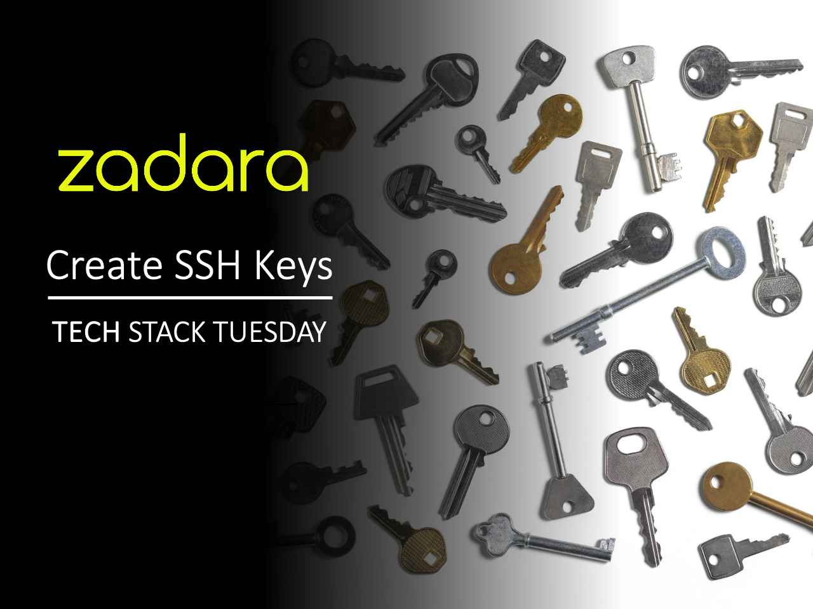

# Methods for Generating SSH Keys on Zadara

There are 3 ways to generate ssh keys for the Zadara platform. In this tutorial
I cover these methods and my preferred method for secure access.

## What are SSH Keys

## Why do I need Keys

## What are the 4 Ways to Generate Keys

### Step 1: Generating Your Key

### Step 2: Creating a Key During VM Deployment

### Step 3: Using the API / Terraform
